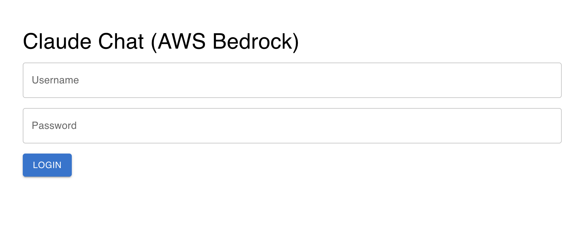
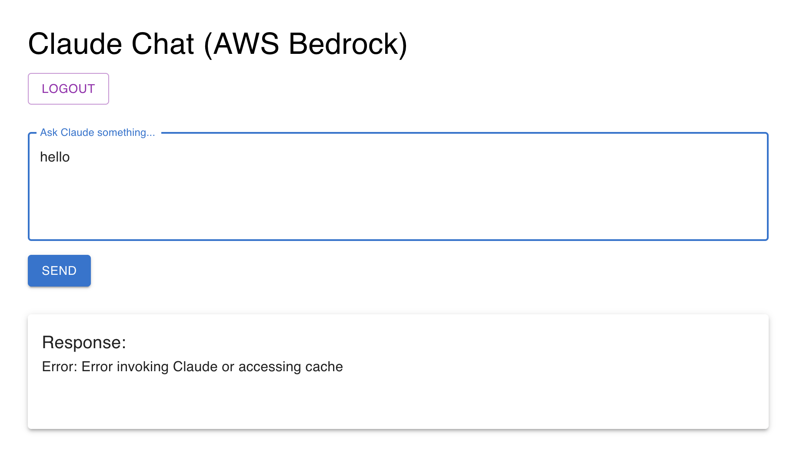

# Claude Chat App (AWS Bedrock + Redis + JWT + TypeScript)

A full-stack AI chat app using AWS Bedrock Claude 3, secured with JWT authentication, Redis caching, React frontend with MUI 5, and Express backend — **both in TypeScript**.

<div align="center">
  
  
  
  
  
  
  
  
</div>

---
### 🔐 Login


### 🤖 dashboard


---

# 🚀 Setup Instructions

## Backend (Express + AWS Bedrock): 

```bash
cd backend
nvm use 20
npm install
npm run dev
```

Server will run at:
http://localhost:3011

.env (Backend): 
```bash
PORT=3011
AWS_REGION=us-east-1
AWS_ACCESS_KEY_ID=your-aws-access-key
AWS_SECRET_ACCESS_KEY=your-aws-secret-key
JWT_SECRET=your-secret-key
```
✅ Uses Claude model: anthropic.claude-3-opus-20240229-v1:0  
✅ Redis must be running (see below)  
✅ Unit tests using Jest (auth, Bedrock, routes)  
✅ GitHub Actions for CI testing  

Backend unit test
| File / Module         | Test file                    | Tests                                     |
|-----------------------|-----------------------------|-------------------------------------------|
| authenticateToken.ts  | middleware/authenticateToken.test.ts | Valid token, invalid token, no token |
| bedrock.ts            | services/bedrock.test.ts    | Mock Claude response, error handling      |
| routes/auth.ts        | routes/auth.test.ts         | Login success, invalid credentials        |
| routes/chat.ts        | routes/chat.test.ts         | Cache hit, cache miss, JWT required       |


## Frontend (React + MUI 5): 
```bash
cd frontend
nvm use 20
npm install
PORT=3010 npm start
```

Server will run at:
http://localhost:3010

.env (Frontend): 
```bash
REACT_APP_API_URL=http://localhost:3011
```

Frontend unit test
| Component | Test file         | Tests                  |
|-----------|------------------|------------------------|
| App       | App.test.tsx     | Title render           |
| LoginForm | LoginForm.test.tsx | Input + login        |
| ChatArea  | ChatArea.test.tsx  | Prompt + send + logout |

## Redis:  
`brew services start redis`

Server will run at:
http://localhost:6379

| Feature                                        | Status |
|------------------------------------------------|--------|
| TypeScript full stack (Node 20)                | ✅     |
| JWT-based login/logout flow                    | 🔒     |
| Claude 3 integration via AWS Bedrock API       | 🤖     |
| Redis caching to avoid duplicate Claude charges| ⚡     |
| React frontend with MUI 5 styling              | 💎     |
| Express REST API (clean modular structure)     | 🔥     |
| Friendly error handling (network/server issues)| 🧠     |
| Secure password hashing with bcrypt            | 🔑     |
| Unauthorized API calls are blocked without JWT | 🚫     |
| Jest unit tests (backend)                      | 🧪     |
| GitHub Actions CI pipeline (backend + frontend)| 🤖     |


